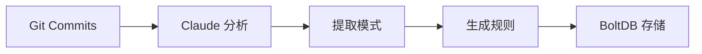
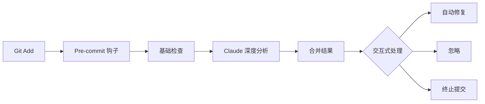

# grow-check 🌱

> **成长型 Git 预提交检查器** - 越用越懂你的项目

[](https://golang.org)
[](LICENSE)

## 🎯 特性

- ✅ **项目级 Skill** - 作为项目的一部分，不污染全局配置
- 🤖 **Claude 集成** - 利用本地 Claude 进行深度代码分析
- 📚 **增量学习** - 从 Git 历史中学习团队的编码模式
- 🔧 **自动修复** - 支持交互式确认和自动修复
- 🚀 **高性能** - BoltDB 本地存储，毫秒级响应

## 📦 安装

### 从源码编译

```bash
# 克隆仓库
git clone https://github.com/openclaw-coding/grow-check.git
cd grow-check

# 编译
make build

# 安装到系统（可选）
sudo make install
```

### 下载预编译版本

```bash
# macOS/Linux
curl -sL https://github.com/openclaw-coding/grow-check/releases/latest/download/grow-check-$(uname -s)-$(uname -m) -o grow-check
chmod +x grow-check
sudo mv grow-check /usr/local/bin/
```

## 🚀 快速开始

### 1. 初始化

在你的 Git 项目根目录下运行：

```bash
cd your-project
grow-check init
```

输出：
```
📦 Initializing grow-check...
  Creating directory structure...
  Generating configuration...
  Initializing memory database...
  Installing Git pre-commit hook...
  Creating hook script...
  Creating README...

✅ grow-check initialized successfully!

📁 Skill location: /path/to/your-project/.skills/grow-check

Next steps:
  1. Learn from history: grow-check learn --since=30d
  2. Make commits and watch it learn!
  3. View patterns: grow-check patterns
  4. View rules: grow-check rules
```

### 2. 首次学习

从 Git 历史中学习团队的编码模式：

```bash
# 学习最近 30 天的提交
grow-check learn --since=30d

# 或学习最近 100 个提交
grow-check learn --max=100
```

输出：
```
🤖 Learning from Git history (last 30 days)...

📚 Analyzing 150 commits...
  [1/150] Analyzing a1b2c3d4...
  [2/150] Analyzing e5f6g7h8...
  ...
  🤖 Analyzing with Claude...

✨ Learned 12 new patterns

📏 Generating rules from patterns...
✅ Created 5 new rules
```

### 3. 正常使用

现在，每次 `git commit` 时，grow-check 会自动运行：

```bash
git add .
git commit -m "Add new feature"
```

输出：
```
🔍 Checking 3 files...
🤖 Analyzing with Claude...

⚠ Found 2 issues:

1. ⚠ auth/login.go:42
   错误处理未包含日志记录
   💡 建议: 在错误处理中添加 log.Printf

2. ℹ database/connection.go:15
   数据库连接缺少超时设置
   💡 建议: 添加 context.WithTimeout

Options:
1. Auto-fix (recommended)
2. View details
3. Ignore (with reason)
4. Abort commit

Your choice [1-4]: 
```

## 📖 CLI 命令

### `grow-check init`

初始化项目级 Skill。

```bash
grow-check init
```

### `grow-check learn`

从 Git 历史学习。

```bash
# 学习最近 30 天
grow-check learn

# 学习最近 7 天
grow-check learn --since=7

# 学习最近 100 个提交
grow-check learn --max=100
```

### `grow-check check`

手动运行检查（等同于 pre-commit 钩子）。

```bash
grow-check check
```

### `grow-check patterns`

查看学习到的模式。

```bash
grow-check patterns
```

输出示例：
```
📋 Learned patterns (12 total):

1. [error_handling] 错误处理必须包含日志
   Confidence: 0.95 | Frequency: 23 | Auto-fixable: true
   Example: if err != nil { log.Printf("...") }

2. [naming] 接口命名使用 -er 后缀
   Confidence: 0.87 | Frequency: 15 | Auto-fixable: false
   Example: type Reader interface { ... }
```

### `grow-check rules`

查看生成的规则。

```bash
grow-check rules
```

## ⚙️ 配置

配置文件位于 `.skills/grow-check/config.yaml`：

```yaml
project:
  name: "your-project"
  initialized_at: "2024-01-15T10:30:00Z"
  git_remote: "https://github.com/user/repo.git"

claude:
  enabled: true
  timeout_seconds: 30
  fallback_to_basic: true  # Claude 不可用时降级到基础检查

learning:
  min_samples_for_rule: 3      # 至少出现 3 次才生成规则
  auto_learn_interval_days: 7  # 自动学习间隔（天）
  max_history_analyze: 1000    # 最多分析 1000 个提交

checking:
  interactive: true      # 交互式确认
  auto_fix: true         # 支持自动修复
  severity_levels:
    - error
    - warning
    - info
  exclude_patterns:
    - "vendor/*"
    - "node_modules/*"
    - "*.pb.go"
    - "*.gen.go"
```

## 🤖 Claude 集成

### 前置要求

安装 Claude CLI：

```bash
# macOS
brew install claude

# Linux
curl -sL https://claude.ai/install.sh | bash
```

### 验证

```bash
claude --version
```

### 离线环境

如果 Claude 不可用，grow-check 会自动降级到基础规则检查：

```yaml
claude:
  enabled: true
  fallback_to_basic: true
```

## 🔧 工作原理

### 1. 学习阶段



### 2. 检查阶段



## 🧪 测试

```bash
# 运行所有测试
make test

# 生成 HTML 覆盖率报告
make test-html
```

## 📝 开发

```bash
# 格式化代码
make fmt

# 代码检查
make lint

# 本地运行
make run ARGS="init"
```

## 🤝 贡献

欢迎贡献！请查看 [CONTRIBUTING.md](CONTRIBUTING.md)。

## 📄 许可证

MIT License - 详见 [LICENSE](LICENSE)

## 🙏 致谢

- [Cobra](https://github.com/spf13/cobra) - CLI 框架
- [BoltDB](https://github.com/etcd-io/bbolt) - 嵌入式数据库
- [Claude](https://claude.ai) - AI 代码分析

---

**Made with ❤️ by the OpenClaw Team**
